# Raytracer - Documentation Développeur

## Présentation générale
Ce projet est un raytracer modulaire en C++ utilisant une architecture orientée plugins. Il permet de charger dynamiquement des primitives (sphères, plans, etc.), des matériaux, des lumières, etc. via des plugins partagés (.so).

L'application principale lit une scène décrite en fichier `.cfg` (libconfig), instancie les objets via les plugins, puis effectue le rendu dans un fichier image PPM ou en mode interactif via une fenêtre SFML.

## Galerie de rendus

Voici quelques exemples de scènes rendues avec le projet. Les images sont stockées dans `assets/screenshots/` pour rester versionnées avec le dépôt et s'afficher correctement sur GitHub.

| Scene | Apercu |
|-------|--------|
| Kick off | 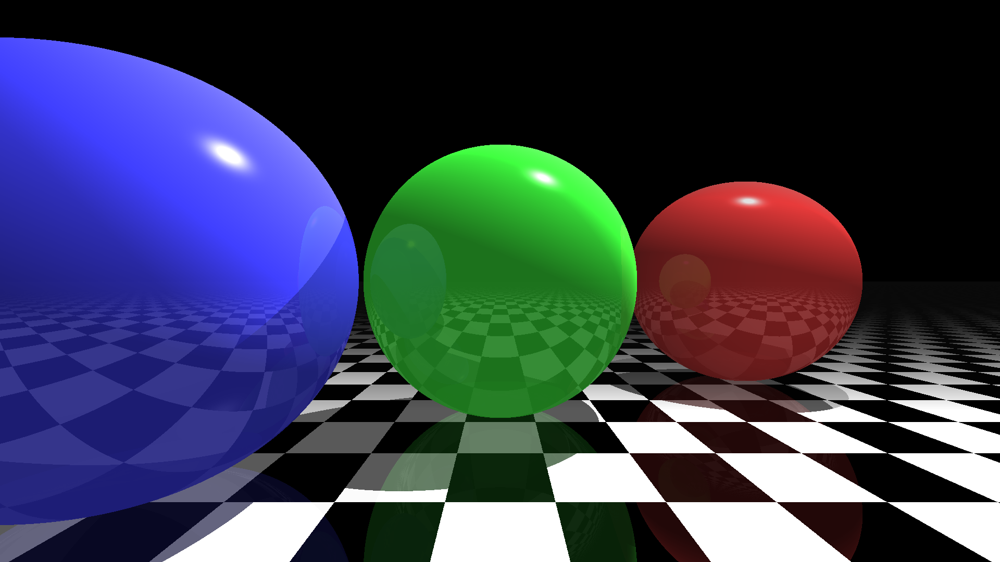 |
| Earth | 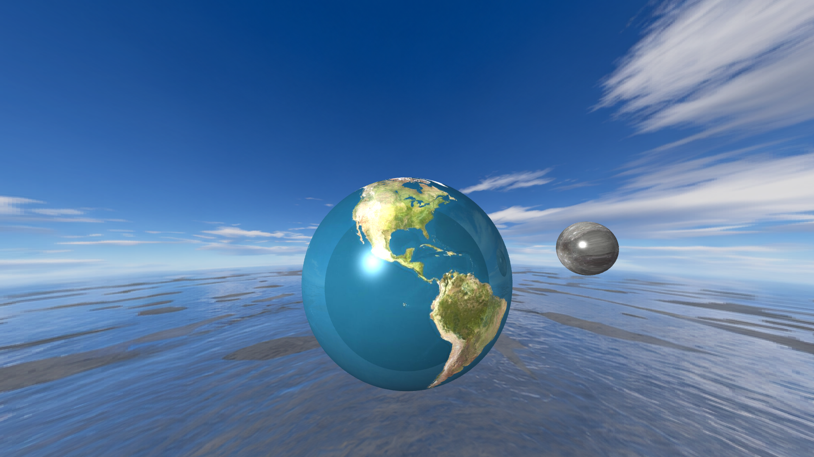 |
| Demo materials | 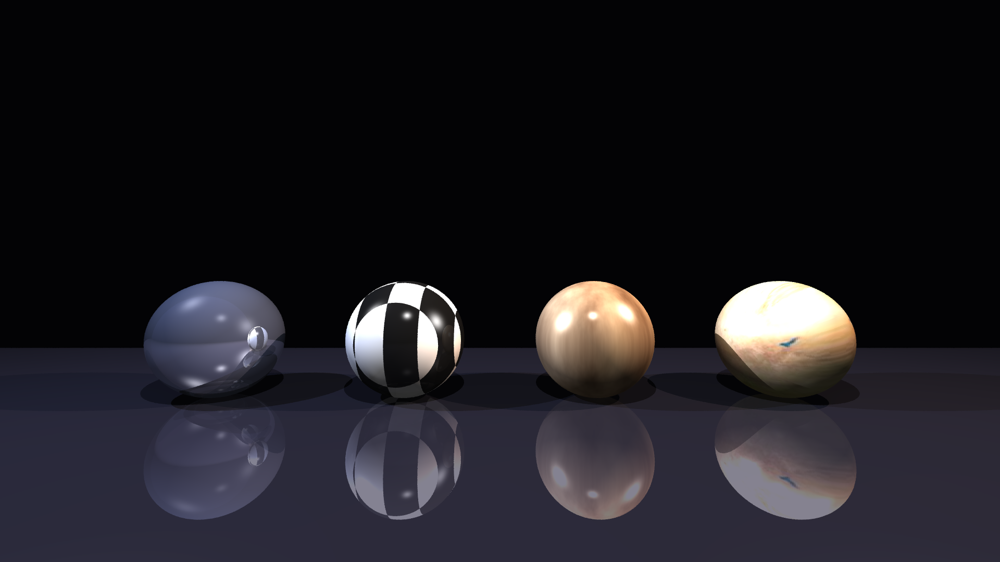 |
| Demo reflections | 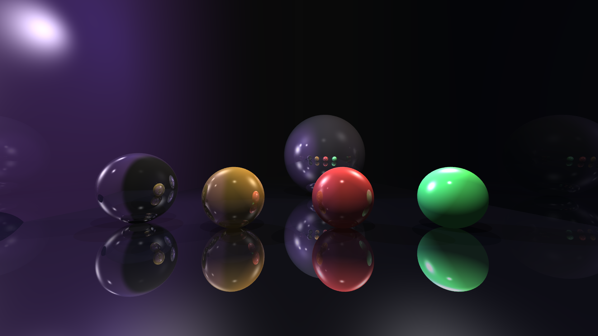 |
| Demo fog | 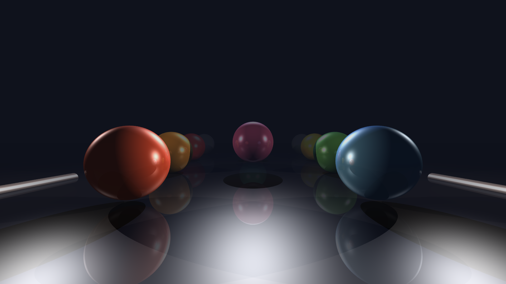 |
| Miroir | 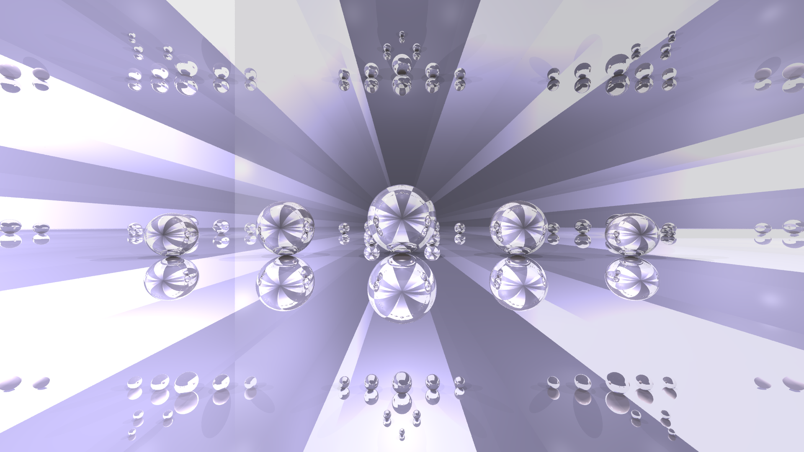 |
| Solar system | 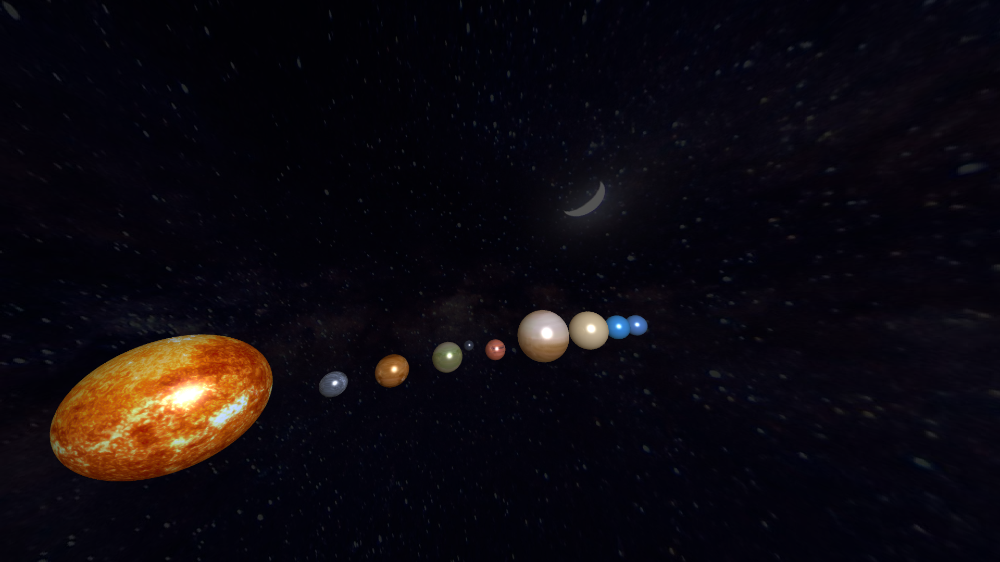 |
| Ambient Occlusion | 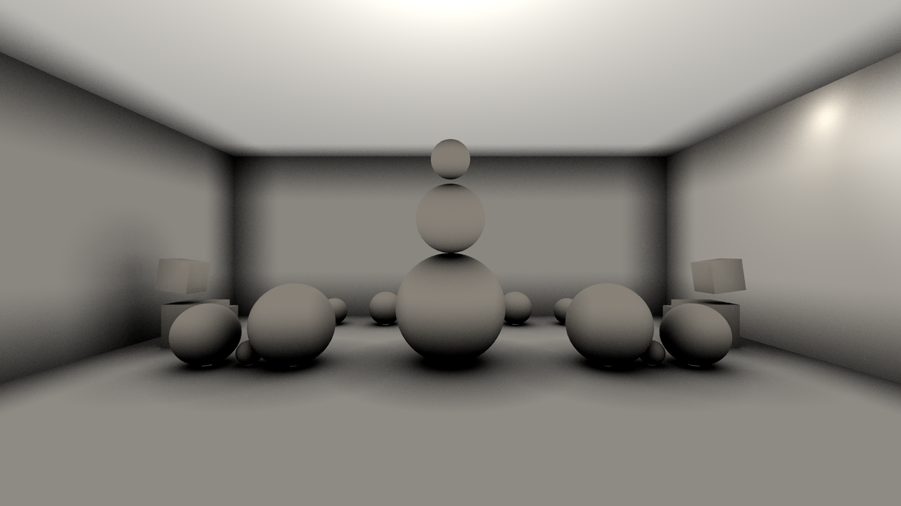 |
| Torus | 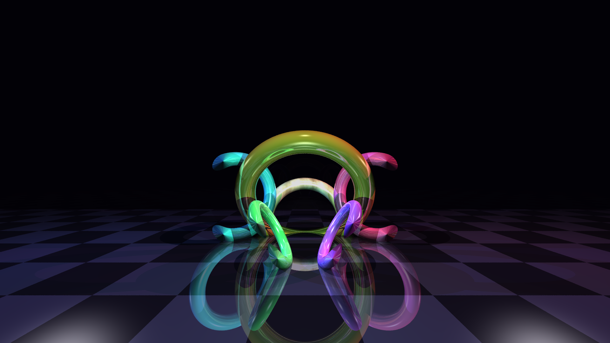 |
| Moebius | 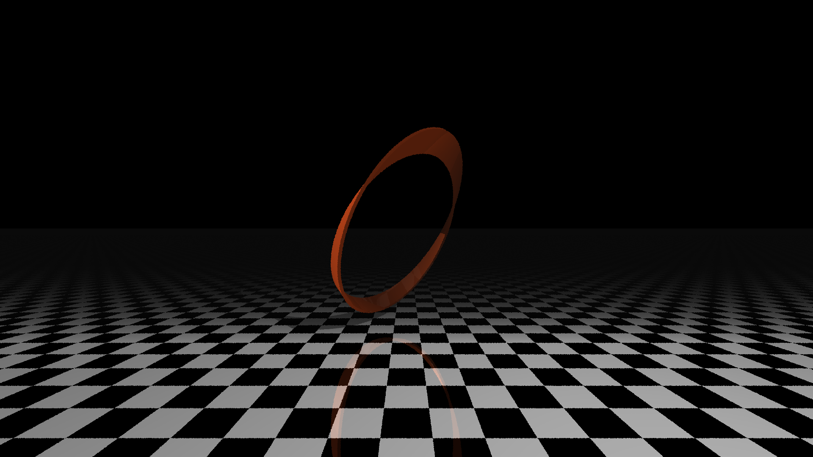 |
| Tanglecubes | 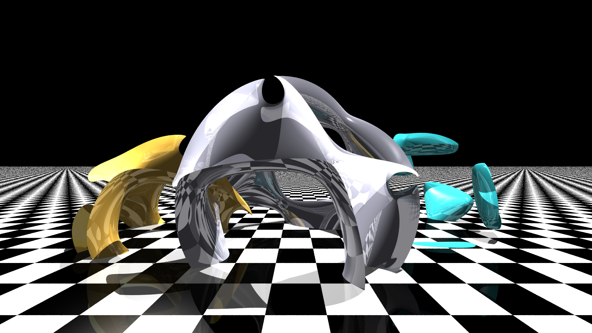 |
| Naruto | 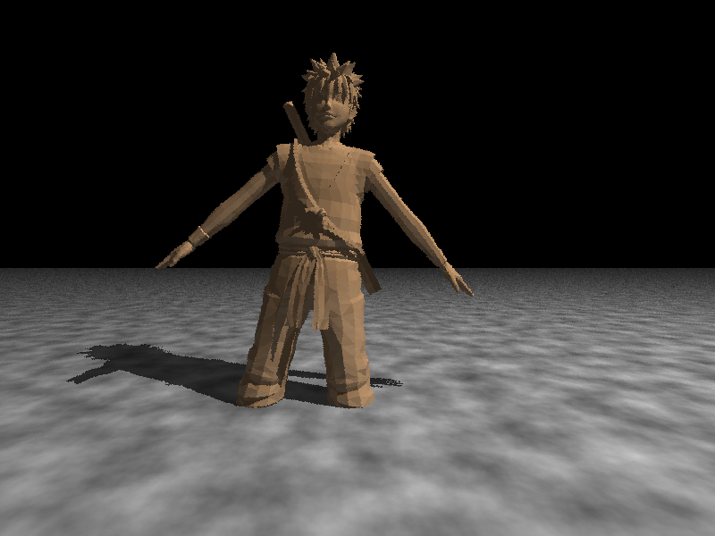 |

## Architecture du projet

- **src/** : cœur du raytracer (parsing, moteur, rendu, interfaces)
  - **Engine/** : moteur principal (Core, Renderer)
  - **Factory/** : gestion des plugins (AFactory, PrimitiveFactory, LightFactory, MaterialFactory, PluginLoader)
  - **Interfaces/** : interfaces pour les plugins (IPrimitive, ILight, IMaterial)
  - **Math/** : outils mathématiques (vecteurs, points, rectangles...)
  - **Parser/** : parsing et validation du fichier de configuration
  - **Camera/** : gestion de la caméra et des rayons (Ray, Camera)
  - **BVH/** : hiérarchie de volumes englobants pour l'optimisation
  - **UI/** : interface utilisateur avec SFML (Window, événements)
- **plugins/** : plugins dynamiques
  - **primitives/** : géométries (Sphere, Plane, Cylinder, Cube, Cone, Triangle, Torus, Moebius, Objmesh)
  - **materials/** : matériaux (Color, Chessboard, PerlinNoise, TextureImage)
  - **lights/** : lumières (PointLight, DirectionalLight)
- **scenes/** : exemples de fichiers de configuration (.cfg)
- **assets/** : textures et images pour les matériaux
- **output.ppm** : image générée

## Fonctionnement général
1. **Chargement de la scène** :
   - Le fichier `.cfg` est parsé (Parser).
   - Les paramètres caméra, primitives, lumières et options de rendu sont extraits et validés.
2. **Chargement des plugins** :
   - Pour chaque plugin (.so) dans `plugins/`, le système charge dynamiquement la librairie.
   - Chaque plugin expose deux fonctions C :
     - `getSectionName()` : retourne le nom de la section à traiter (ex : "spheres", "lights").
     - `createPlugin(const libconfig::Setting&)` : instancie un objet à partir d'une config.
   - Les Factories chargent les plugins et instancient les objets selon la configuration.
3. **Construction du BVH** :
   - Tous les primitives sont organisés dans une hiérarchie de volumes englobants.
   - Optimise les calculs d'intersection lors du rendu.
4. **Rendu** :
   - La caméra et les objets sont transmis au Renderer.
   - Le rendu est parallélisé (multithreading) avec des rayons tracés pixel par pixel.
   - En mode non-interactif : génération d'image PPM.
   - En mode interactif (`--display`) : rendu en temps réel dans une fenêtre SFML avec prévisualisation rapide.

## Mode d'utilisation

### Mode non-interactif (rendu fichier)
```sh
./raytracer scenes/example.cfg
```
Génère une image PPM dans `output.ppm`.

### Mode interactif (fenêtre SFML)
```sh
./raytracer scenes/example.cfg --display
# ou
./raytracer scenes/example.cfg -d
```
Ouvre une fenêtre avec prévisualisation rapide et rendu complet en arrière-plan.

**Contrôles clavier** :
- **Z** : avancer (axe Y+)
- **S** : reculer (axe Y-)
- **Q** : aller à gauche (axe X-)
- **D** : aller à droite (axe X+)
- **Space** : monter (axe Z+)
- **Shift** : descendre (axe Z-)
- **R** : recharger la scène
- **Échap** / **Fermer** : quitter

## Primitives disponibles

| Nom | Section .cfg | Paramètres | Fichier |
|-----|-------------|-----------|---------|
| Sphere | `spheres` | `x`, `y`, `z`, `r` | `plugins/primitives/Sphere.cpp` |
| Plane | `planes` | `axis`, `position` | `plugins/primitives/Plane.cpp` |
| Cylinder | `cylindres` | `x`, `y`, `z`, `r`, `h`, `rotation` | `plugins/primitives/Cylindre.cpp` |
| Cone | `cones` | `x`, `y`, `z`, `r`, `h`, `rotation` | `plugins/primitives/Cone.cpp` |
| Cube | `cubes` | `x`, `y`, `z`, `sizeX`, `sizeY`, `sizeZ`, `rotation` | `plugins/primitives/Cube.cpp` |
| Triangle | `triangles` | `v0`, `v1`, `v2` (sommets) | `plugins/primitives/Triangle.cpp` |
| Torus | `torus` | `x`, `y`, `z`, `R`, `r`, `rotation` | `plugins/primitives/Torus.cpp` |
| Moebius Strip | `moebius` | `x`, `y`, `z`, `R`, `w`, `rotation` | `plugins/primitives/Moebius.cpp` |
| Tanglecube | `tanglecubes` | `x`, `y`, `z`, `scale`, `rotation` | `plugins/primitives/Tanglecube.cpp` |
| OBJ Mesh | `objmeshes` | `path`, `scale`, `offset`, `translation`, `rotation` | `plugins/primitives/Objmesh.cpp` |
| Fractal (Mandelbulb) | `fractals` | `x`, `y`, `z`, `scale`, `power`, `iterations`, `bailout`, `rotation` | `plugins/primitives/Fractal.cpp` |

Chaque primitive supporte les transformations :
- `translation` : déplacement (x, y, z)
- `rotation` : rotation en degrés (x, y, z)
- `material` : référence au matériau

## Matériaux disponibles

| Nom | Section .cfg | Paramètres | Fichier |
|-----|-------------|-----------|---------|
| Color | `material: { type = "Color"; color = { r = ...; g = ...; b = ...; }; }` | `color` (RGB 0-255), `reflectivity` | `plugins/materials/Color.cpp` |
| Chessboard | `material: { type = "Chessboard"; ... }` | `scale`, `color1`, `color2`, `reflectivity` | `plugins/materials/Chessboard.cpp` |
| PerlinNoise | `material: { type = "PerlinNoise"; ... }` | `scale`, `octaves`, `persistence`, `reflectivity` | `plugins/materials/PerlinNoise.cpp` |
| Texture | `material: { type = "Texture"; path = "..."; }` | `path` (PNG/JPG/JPEG), `reflectivity` | `plugins/materials/Texture.cpp` |

### Texture — Texturing depuis un fichier image

Le matériau `Texture` permet d'appliquer une image (PNG, JPG, JPEG, BMP...) comme texture sur n'importe quelle primitive. Le mapping UV est **sphérique** : l'image est projetée sur la primitive en utilisant les coordonnées angulaires de la normale (atan2/asin), ce qui convient parfaitement aux sphères et aux surfaces courbées.

**Paramètres** :
- `path` *(obligatoire)* : chemin vers l'image (relatif au répertoire de lancement, ex : `"assets/earth.jpg"`)
- `reflectivity` *(optionnel, défaut 0.0)* : coefficient de réflexion entre 0.0 et 1.0

**Exemple d'utilisation dans un .cfg** :
```cfg
material = {
    type = "Texture";
    path = "assets/earth.jpg";
    reflectivity = 0.05;
};
```

**Formats supportés** : PNG, JPG, JPEG, BMP, TGA, GIF (via stb_image).

**Installation de la dépendance stb_image** (à faire une seule fois) :
```sh
mkdir -p src/stb
curl -o src/stb/stb_image.h https://raw.githubusercontent.com/nothings/stb/master/stb_image.h
```

**Exemple de scène complète** : voir `scenes/solar_system.cfg`

## Lumières disponibles

| Nom | Section .cfg | Paramètres | Fichier |
|-----|-------------|-----------|---------|
| Point Light | `lights: { point = [ { x; y; z; intensity; color; phong; } ] }` | position, `intensity`, `color` (RGB), `phong` (brillance) | `plugins/lights/PointLight.cpp` |
| Directional Light | `lights: { directional = [ { direction; intensity; color; } ] }` | `direction` (x, y, z), `intensity`, `color` (RGB) | `plugins/lights/DirectionalLight.cpp` |

## Configuration avancée de la scène

Dans la section `camera` du fichier `.cfg` :
```cfg
camera:
{
    resolution = { width = 1920; height = 1080; };
    position   = { x = 0; y = -100; z = 20; };
    rotation   = { x = 0; y = 0; z = 0; };
    fieldOfView = 72.0;           # Champ de vision en degrés
    antialiasing = 2;             # 2x2 = 4 samples par pixel

    fog = {
        start = 100.0;            # Distance de début du brouillard
        density = 0.01;           # Densité du brouillard
    };
};
```

En section `lights` :
```cfg
lights:
{
    ambient = 0.4;                # Lumière ambiante globale
    diffuse = 0.8;                # Lumière diffuse globale

    # Optionnel : Ambient Occlusion
    # ao = {
    #     samples = 64;
    #     radius = 50.0;
    #     intensity = 0.8;
    # };

    point = (
        { x = 100; y = 100; z = 200; intensity = 1.0;
          color = { r = 255; g = 255; b = 255; }; phong = 128; }
    );

    directional = (
        { x = 0.5; y = 1.0; z = 1.0; intensity = 0.5;
          color = { r = 200; g = 200; b = 255; }; }
    );
};
```

Arrière-plan (optionnel) :
```cfg
background = {
    r = 50; g = 100; b = 200;
};
```

## Ajouter un plugin (ex : primitive, matériau, lumière...)

1. **Créer un fichier source dans le dossier plugins approprié**
   - Exemple : `plugins/primitives/MyPrimitive.cpp`
2. **Implémenter l'interface**
   - Hériter de l'interface adaptée (ex : `IPrimitive`, `IMaterial`, `ILight`).
   - Implémenter les méthodes virtuelles requises.
3. **Exposer les fonctions C obligatoires**
   - `extern "C" const char *getSectionName()` : retourne le nom de la section à lire dans le .cfg (ex : "myprimitives").
   - `extern "C" T *createPlugin(const libconfig::Setting &config)` : construit et retourne un pointeur vers l'objet.

   Exemple minimal :
   ```cpp
   #include <libconfig.h++>
   #include "../../src/Interfaces/IPrimitive.hpp"

   class MyPrimitive : public IPrimitive {
       // Implémenter toutes les méthodes virtuelles
   };

   extern "C" const char *getSectionName() { return "myprimitives"; }
   extern "C" IPrimitive *createPlugin(const libconfig::Setting &config) { return new MyPrimitive(config); }
   ```
4. **Utiliser le helper LibconfigHelper pour parser la config**
   - `LibconfigHelper::getNumeric(config, "key")` : extraire un nombre
   - Voir exemples dans les plugins existants
5. **Compiler le plugin**
   - Utiliser `make plugins` pour compiler uniquement les plugins.
   - Le Makefile détecte automatiquement les `.cpp` dans `plugins/` et génère les `.so`.
6. **Déclarer la section dans le .cfg**
   - Ajouter une section correspondant à `getSectionName()` dans la partie appropriée du fichier de config.

## Fichier de configuration (.cfg)
- Utilise la syntaxe **libconfig**.
- Doit contenir au minimum les sections : `camera`, `primitives`, `lights`.
- Les sections `primitives` et `lights` peuvent être vides si aucun objet n'est nécessaire.
- Voir les exemples complets dans `scenes/`.

## Dépendances
- **C++20**
- **libconfig++** : parsing des fichiers de configuration
- **SFML** : interface utilisateur interactive (Gestion des fenêtres, affichage temps réel)
- **dlopen/dlsym** : chargement dynamique des plugins (standard POSIX)
- **stb_image** (header-only) : chargement d'images pour le matériau TextureImage

## Compilation
```sh
make              # Compile tout (plugins + exécutable)
make plugins      # Compile uniquement les plugins
make clean        # Supprime les fichiers .o
make fclean       # Supprime tout (y compris exécutable et .so)
make re           # Recompile tout
```

## Lancer le raytracer

**Aide** :
```sh
./raytracer --help
```

**Mode fichier (génère output.ppm)** :
```sh
./raytracer scenes/example.cfg
```

**Mode interactif (fenêtre SFML)** :
```sh
./raytracer scenes/example.cfg --display
./raytracer scenes/example.cfg -d
```
